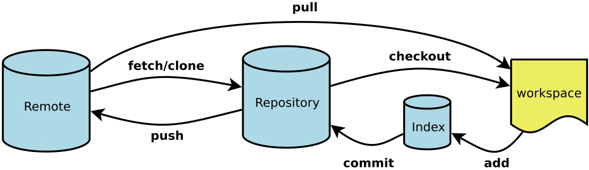

# Git

* [Git](https://git-scm.com) 是目前世界上最先进的分布式版本管理工具。通常采用git命令行工具跟 [Smartgit](https://www.syntevo.com/smartgit) 混合使用。Smartgit用来看log和处理版本冲突非常简单。

* 工作流程
    
    ```
    Workspace：工作区
    Index / Stage：暂存区
    Repository：仓库区（或本地仓库）
    Remote：远程仓库
    ```
* SVN与Git的最主要的区别？

    - SVN是集中式版本控制系统，版本库是集中放在中央服务器的，而干活的时候，用的都是自己的电脑，所以首先要从中央服务器哪里得到最新的版本，然后干活，干完后，需要把自己做完的活推送到中央服务器。集中式版本控制系统是必须联网才能工作，如果在局域网还可以，带宽够大，速度够快，如果在互联网下，如果网速慢的话，就纳闷了。

    - Git是分布式版本控制系统，那么它就没有中央服务器的，每个人的电脑就是一个完整的版本库，这样，工作的时候就不需要联网了，因为版本都是在自己的电脑上。既然每个人的电脑都有一个完整的版本库，那多个人如何协作呢？比如说自己在电脑上改了文件A，其他人也在电脑上改了文件A，这时，你们两之间只需把各自的修改推送给对方，就可以互相看到对方的修改了。

## 常用命令

### 初始化

```bash
git init
``` 

### 提交分支代码

```bash
git add . /git add readme.md #将所有文件放到暂存区 or 将所单个文件放到暂存区
git commit -m "First commit"
git push
```

### 拉取master分支代码

```bash
git pull
```

### 将Merge分支代码合并到本分支

```bash
git merge origin/master 
```

### 创建分支和切换分支

```bash
git branch ldp-first-branch # 创建ldp-first-branch分支

git checkout -b ldp-first-branch # 创建分支并切换到该分支

git checkout test # 切换到test分支

git branch -D ldp-first-branch  # 删除本地ldp-first-branch分支

git push --delete origin oldName # 删除远程分支

git reset --hard origin/master # 重置当前目录代码跟远程分支master保持一致
```

## 其他
### git用户名查看与修改

1. 查看邮箱地址和用户名

```
1. git config user.name
2. git config user.email
```

2. 修改局部用户名和邮箱地址

```
1. git cinfig user.name "username"
2. git cinfig user.email "xxx.@email.com"
```

3. 修改全局用户名和邮箱地址

```
1. git cinfig --global user.name "username"
2. git cinfig --global user.email "xxx.@email.com"
```
4. 其他

```bash
git status # 查看当前目录git状态

git checkout . # 撤销修改

git clone git@github.com:git/git.git # clone远程代码
```

## 注意

### master

`master` 是稳定分支，这上面的代码一定是稳定可发布的。

`stage` 和 `production` 环境均使用 `master` 分支代码。

### test

所有需要测试的开发分支均合并到 `test` 分支上并部署到 `test` 环境。

::: danger 注意
`test` 分支是一个只进不出的分支。勿把 `test` 分支上的代码切去做开发或合并到 `master`。
:::

### 开发分支

::: tip 约定
1. 分支名字统一采用小写加 `-` 相连。

2. 多人合作开发时，建议采用开发者名称缩写为分支前缀，例开发者`liduapong` 创建分支名为`ldp-test-branch`,这样比较清晰直观看出谁创建了几个分支，也可快速切换到自己分支。

3. 所有的开发分支在合并之后都要被删除。
